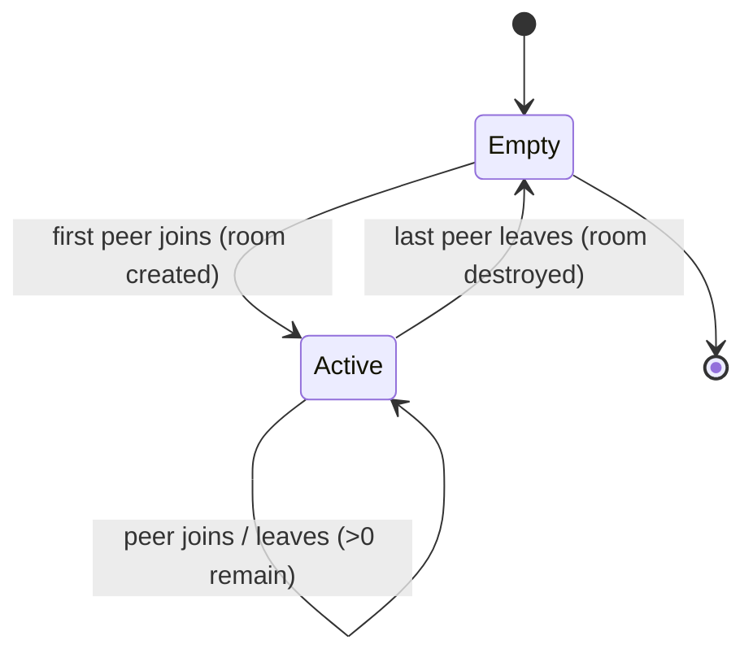
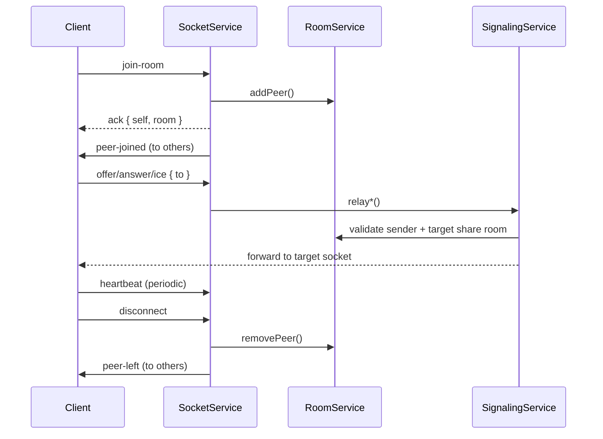
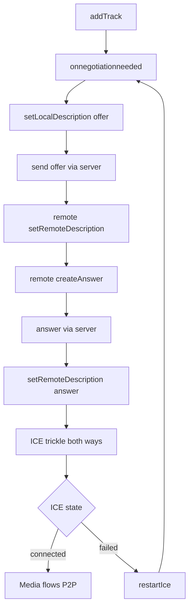
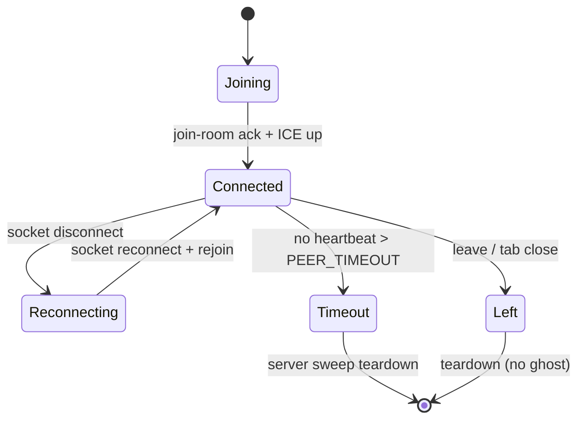
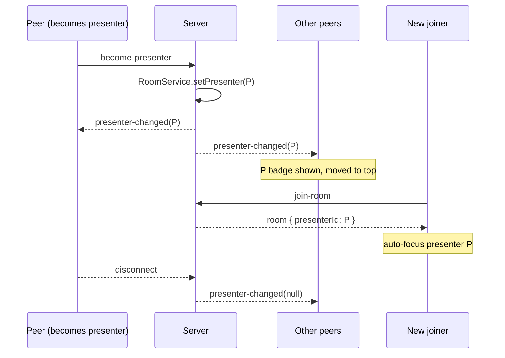

# Diagrams

Mermaid diagrams for the core flows. (GitHub renders these natively.)

## Room Lifecycle

```mermaid
stateDiagram-v2
    [*] --> Empty
    Empty --> Active: first peer joins (room created)
    Active --> Active: peer joins / leaves (>0 remain)
    Active --> Empty: last peer leaves (room destroyed)
    Empty --> [*]
```

## Signaling Flow

```mermaid
sequenceDiagram
    participant C as Client
    participant S as SocketService
    participant R as RoomService
    participant Sig as SignalingService

    C->>S: join-room
    S->>R: addPeer()
    S-->>C: ack { self, room }
    S->>C: peer-joined (to others)
    C->>S: offer/answer/ice { to }
    S->>Sig: relay*()
    Sig->>R: validate sender + target share room
    Sig-->>C: forward to target socket
    C->>S: heartbeat (periodic)
    C->>S: disconnect
    S->>R: removePeer()
    S->>C: peer-left (to others)
```

## WebRTC Connection Flow

```mermaid
flowchart TD
    A[addTrack] --> B[onnegotiationneeded]
    B --> C[setLocalDescription offer]
    C --> D[send offer via server]
    D --> E[remote setRemoteDescription]
    E --> F[remote createAnswer]
    F --> G[answer via server]
    G --> H[setRemoteDescription answer]
    H --> I[ICE trickle both ways]
    I --> J{ICE state}
    J -->|connected| K[Media flows P2P]
    J -->|failed| L[restartIce] --> B
```

## Peer Lifecycle

```mermaid
stateDiagram-v2
    [*] --> Joining
    Joining --> Connected: join-room ack + ICE up
    Connected --> Reconnecting: socket disconnect
    Reconnecting --> Connected: socket reconnect + rejoin
    Connected --> Timeout: no heartbeat > PEER_TIMEOUT
    Connected --> Left: leave / tab close
    Timeout --> [*]: server sweep teardown
    Left --> [*]: teardown (no ghost)
```

## Presenter Flow

```mermaid
sequenceDiagram
    participant P as Peer (becomes presenter)
    participant S as Server
    participant O as Other peers
    participant N as New joiner

    P->>S: become-presenter
    S->>S: RoomService.setPresenter(P)
    S-->>P: presenter-changed(P)
    S-->>O: presenter-changed(P)
    Note over O: P badge shown, moved to top
    N->>S: join-room
    S-->>N: room { presenterId: P }
    Note over N: auto-focus presenter P
    P-->>S: disconnect
    S-->>O: presenter-changed(null)
```
