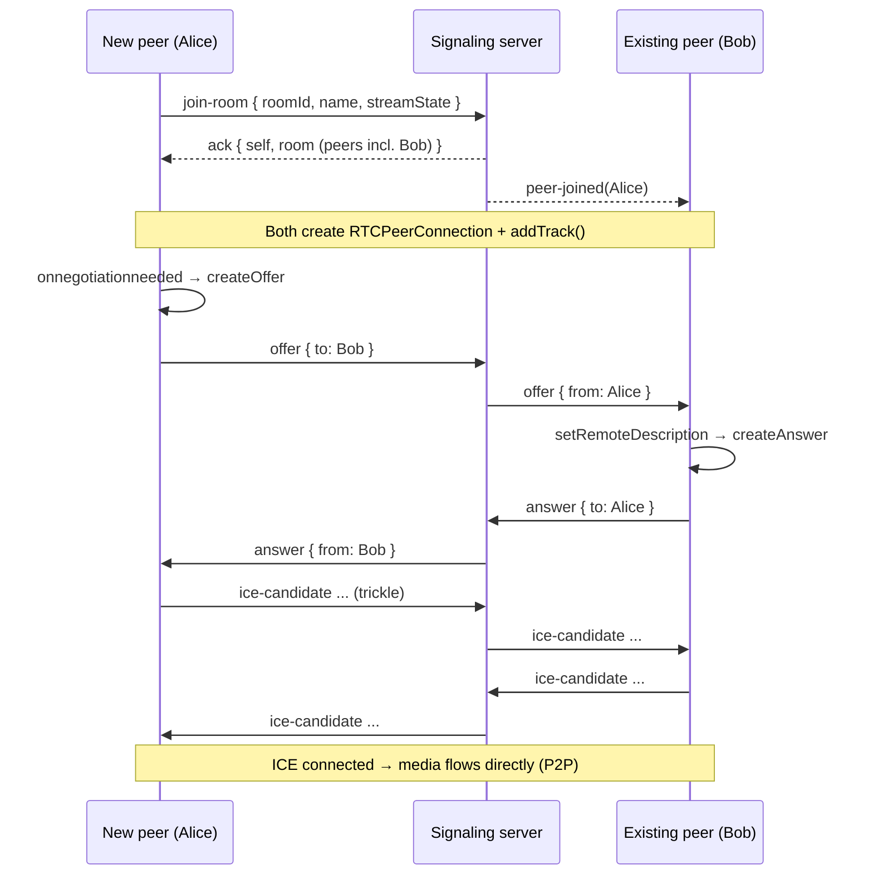
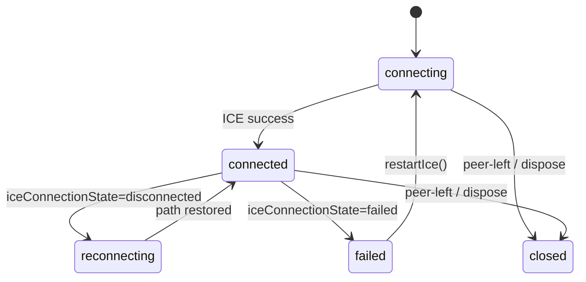

# WebRTC Flow

The server is a **relay**. All media negotiation happens between browsers using
the **Perfect Negotiation** pattern (MDN / WebRTC spec). This document explains
the exact sequence and the edge cases handled.

## Perfect Negotiation in one paragraph

Each `PeerConnection` is assigned a stable, *opposite* role on the two ends:
exactly one peer is **polite**. We compute `polite = selfId < peerId` — a string
comparison that is deterministic and yields opposite results on each side. When
both peers add tracks at once, two offers can collide ("glare"). The **impolite**
peer ignores an incoming offer that arrives while it is mid-offer; the **polite**
peer rolls back and accepts. No manual offer/answer state machine, no deadlocks.

## Joining and connecting

## Connection failure & recovery

- **ICE restart:** on `iceConnectionState === 'failed'` the peer calls
  `restartIce()` (or a manual `iceRestart` offer), renegotiating a fresh path.
- **Stream replacement:** toggling screen share swaps the outgoing video track
  via `RTCRtpSender.replaceTrack()` — no renegotiation, no flicker.
- **Renegotiation:** any `onnegotiationneeded` (adding the screen track after a
  mic-only start) re-runs the offer/answer exchange under Perfect Negotiation.

## Media model

- **Mic:** `getUserMedia({ audio: true, video: false })` — always; muting just
  flips `track.enabled` so the connection is never renegotiated to toggle audio.
- **Screen:** `getDisplayMedia({ video: true, audio: systemAudio })`.
- **Camera:** never requested anywhere in the codebase.
- The outbound `MediaStream` is the union of the live mic + screen tracks;
  `MediaManager.syncOutbound()` keeps it correct after every change, and the
  `video` track's `ended` event detects "Stop sharing", tab close, or revocation.

## What the server validates

- Sender must be a joined member.
- Target peer must exist **in the same room** (prevents cross-room spoofing and
  stale-target delivery).
- It forwards SDP/ICE byte-for-byte; it parses neither.
